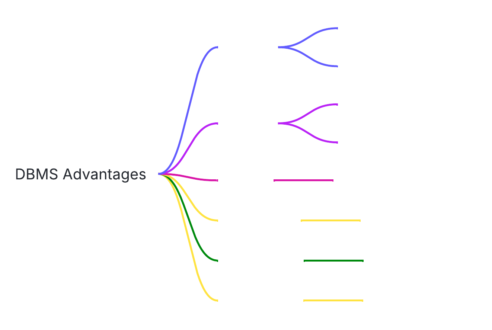

# Database Course Documentation

## 1. Flat File Systems vs. Relational Databases

| Aspect            | Flat File Systems                          | Relational Databases                         |
|-------------------|--------------------------------------------|---------------------------------------------|
| **Structure**     | Single-file, no relationships              | Multi-table with relationships (keys)       |
| **Data Redundancy**| High (duplicated data)                    | Low (normalization minimizes duplicates)    |
| **Relationships** | Manual linking required                   | Built-in via foreign keys                   |
| **Example Usage** | CSV files, spreadsheets                   | Banking systems, inventory management       |
| **Drawbacks**     | Update anomalies, limited scalability     | Complex design, requires SQL knowledge      |

## 2. DBMS Advantages Mind Map

## 3. Database System Roles

| Role                       | Responsibilities                                                                 |
|----------------------------|---------------------------------------------------------------------------------|
| **System Analyst**         | Requirements gathering, process modeling                                        |
| **Database Designer**      | Creates ER diagrams, normalizes schema                                          |
| **Database Developer**     | Implements database objects (tables, views, SPs)                               |
| **Database Administrator** | Manages security, backup/recovery, performance tuning                           |
| **Application Developer**  | Builds apps using database APIs                                                 |
| **BI Developer**           | Designs data warehouses, creates reports/dashboards                             |

## 4. Types of Databases

### Relational vs Non-Relational
| **Relational (SQL)**       | **Non-Relational (NoSQL)**                     |
|----------------------------|-----------------------------------------------|
| Structured schema          | Flexible schema                               |
| ACID transactions          | BASE consistency                              |
| MySQL, PostgreSQL          | MongoDB (document), Cassandra (columnar)      |

**Use Cases:**
- Relational: Financial transactions
- Document DB: Content management
- Graph DB: Social networks

### Deployment Models
| **Centralized**       | **Distributed**         | **Cloud**               |
|-----------------------|-------------------------|-------------------------|
| Single location       | Multiple nodes          | Provider-managed        |
| Limited scalability   | Horizontal scaling      | Auto-scaling            |
| Legacy systems        | Blockchain applications | SaaS applications       |

## 5. Cloud Storage & Databases

### Key Relationships
- **Cloud Storage** provides scalable infrastructure for database files
- **Managed Services** handle maintenance (patches, backups)
- **Hybrid Models** allow on-premise + cloud integration

### Advantages
- Auto-scaling (handle traffic spikes)
- Pay-as-you-go pricing
- Built-in high availability (e.g., Azure Zone Redundancy)
- Automated backups

### Challenges
- Data sovereignty concerns
- Network latency
- Vendor lock-in risks
- Ongoing operational costs
